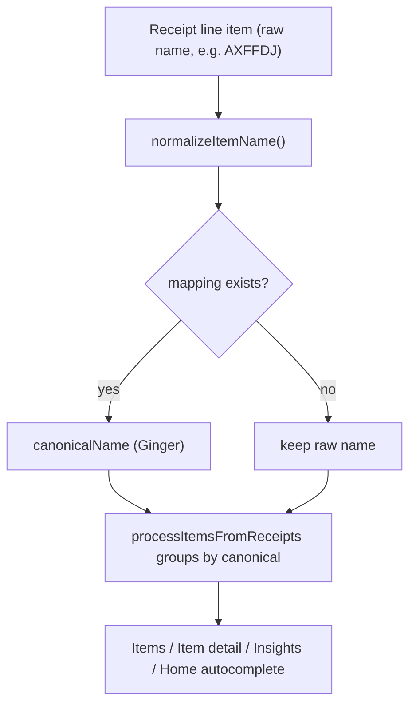

# Item Mapping Association

## Goal & chosen model (confirmed with you)
- **Non-destructive**: receipts always store the **raw scanned name**. A separate mappings store resolves `raw -> canonical` when items are derived. Deleting a mapping reverts everything.
- **Global key**: mapping matches on the **normalized raw item name only** (`name.toLowerCase().trim()`), across all stores. Distinct codes per store (AXFFDJ, GGNG7) each get their own mapping to the same canonical.
- **Auto-apply with indicator**: on the Home review screen a matched item shows the canonical name with a "mapped from `<raw>`" badge and an override/change action.
- **Learned every time**: each association writes/updates a mapping immediately, so the next scan resolves automatically. No ML needed - it is a growing deterministic dictionary.

## Why this fits the codebase
- Items are **fully derived, not stored** - [`lib/itemsProcessor.ts`](lib/itemsProcessor.ts) groups line items by `item.name.toLowerCase().trim()`. Inserting a raw->canonical resolve step before grouping folds all historical receipts together instantly (retroactive), with no receipt rewrites.
- Every catalog/insights surface funnels through `processItemsFromReceipts` (directly or via `getItemByName` / `getAllItemNames` / `getItemNamesForAnalytics` in [`lib/analyticsUtils.ts`](lib/analyticsUtils.ts)). One resolve step covers Items, Item detail, Insights, and Home autocomplete.
- A new `data/mappings/` store mirrors the existing storage skeleton exactly (DEVELOPER_GUIDE Section 13): `getXDataDir` / `ensureXDataDirExists` / `getAllX` / `saveX`, return boolean, `console.log('✅ ...')`.
- The [`/api/settings`](app/api/settings/route.ts) route + [`useSettings`](lib/hooks/useSettings.ts) / [`useStores`](lib/hooks/useStores.ts) hooks are the templates for a new CRUD route + hook (`{ success }` shape, `runtime = 'nodejs'`, top-level try/catch).

## Resolution flow

## Design decisions baked in
- **Data shape** (`data/mappings/mappings_data.json`): array of records `{ normalizedRaw, rawName, canonicalName, createdAt, updatedAt }`. `normalizedRaw` is the unique key; camelCase fields + string keys for future Mongo migration (DEVELOPER_GUIDE Section 1).
- **Single-hop resolution with cycle/self-map guard** (if `canonicalName` normalizes to `normalizedRaw`, ignore). Keeps it predictable.
- **Storage stays untouched at save time**: `handleSaveReceipt` in [`app/page.tsx`](app/page.tsx) keeps writing the raw name; mapping is a read-time overlay. Manual free-text edits still store what the user types (today's behavior), and do NOT auto-create a mapping unless the user uses the "Map to" action.
- **Do not touch [`/api/process-receipt`](app/api/process-receipt/route.ts)**: resolution is client-side via the new hook + pure helper, so the route's `{ data, metadata }` contract (DEVELOPER_GUIDE Section 14) is preserved.

---

## Phase 1 - Core data + pure resolution (no UI)
- Create [`lib/itemMappings.ts`](lib/itemMappings.ts) (client-safe, pure, no `fs`): `ItemMapping` type, `normalizeItemName(name)`, `buildMappingIndex(mappings): Map<string,string>`, `resolveCanonicalName(rawName, index): string`, and `applyItemMappings(receipts, mappings): SavedReceipt[]` (returns receipts with each `item.name` replaced by its resolved canonical; raw untouched in storage). This is the single reusable resolve helper for client + derivation.
- Create [`lib/mappingsStorage.ts`](lib/mappingsStorage.ts) mirroring [`lib/storesStorage.ts`](lib/storesStorage.ts): `getMappingsDataDir`, `ensureMappingsDataDirExists`, `getAllMappings()`, `saveAllMappings()`, `addMapping(rawName, canonicalName)` (upsert by `normalizedRaw`, sets timestamps), `deleteMapping(normalizedRaw)`. Seed empty `[]` on first read.
- Treat `data/mappings/mappings_data.json` like settings data in `.gitignore` (auto-created, not committed).

## Phase 2 - API route + client hook
- Create [`app/api/mappings/route.ts`](app/api/mappings/route.ts): `GET` (list), `POST` `{ rawName, canonicalName }` (validate non-empty, upsert), `DELETE` `?normalizedRaw=` , `PUT` `{ mappings }` (replace all / clear). `export const runtime = 'nodejs'`, top-level try/catch + `console.error`, `{ success, ... }` shape.
- Create [`lib/hooks/useMappings.ts`](lib/hooks/useMappings.ts) mirroring `useStores`: `{ mappings, isLoading, addMapping, deleteMapping, reload }`, each mutation returns `MutationResult` and refetches.

## Phase 3 - Apply mappings to all derived data (retroactive consolidation)
- In the 4 read surfaces, wrap receipts once with `applyItemMappings(receipts, mappings)` and feed the result into the existing (unchanged) derivation functions:
  - [`app/items/page.tsx`](app/items/page.tsx) -> `processItemsFromReceipts(mapped)`
  - [`app/items/[name]/page.tsx`](app/items/[name]/page.tsx) -> `getItemByName(mapped, name)`
  - [`app/insights/page.tsx`](app/insights/page.tsx) -> `getItemNamesForAnalytics(mapped)` + `getItemByName(mapped, ...)`
  - [`app/page.tsx`](app/page.tsx) -> `getAllItemNames(mapped)` for autocomplete
- Each page pulls `useMappings()` and `useMemo`s the mapped receipts. Result: existing AXFFDJ / GGNG7 receipts immediately catalog under "Ginger" with merged price history and insights.
- Keeping `applyItemMappings` in the derivation layer (not re-deriving in pages) satisfies DEVELOPER_GUIDE Section 19.

## Phase 4 - Associate on the Home review screen (the "map it right there" moment)
- Extend [`EditableItemName.tsx`](app/components/EditableItemName.tsx) / [`ExtractedDataDisplay.tsx`](app/components/ExtractedDataDisplay.tsx): for each extracted row, resolve the raw name via `useMappings`; if mapped, show canonical name + a small "mapped from `<raw>`" badge (Lucide icon, CSS variables, no emojis) with a "Change" action; if unmapped, show a "Map to..." action reusing the existing canonical-name picker (existing names from `getAllItemNames(mapped)` + "Create new").
- Confirming an association calls `useMappings.addMapping(rawScannedName, canonicalName)` -> learned instantly; badge flips to mapped. Surface success/error inline per DEVELOPER_GUIDE Section 15.
- Non-destructive: the saved `extractedData.items[].name` remains the raw scanned string; the overlay handles display + future derivation. Add a brief note/tooltip so the user understands raw is preserved.

## Phase 5 - Manage mappings + reconcile rename (management UI + docs)
- Add an "Item Mappings" section to [`Settings.tsx`](app/components/Settings.tsx) (matches existing stores/units management, avoids a new nav entry): list `rawName -> canonicalName`, edit canonical, delete, and a "Discover unmapped items" helper (list raw names present in receipts that have no mapping and are not already canonical - mirrors unit discovery in [`lib/unitsStorage.ts`](lib/unitsStorage.ts)).
- Reconcile the currently **destructive** rename in [`app/items/[name]/page.tsx`](app/items/[name]/page.tsx) (`handleItemRename` rewrites every receipt). Recommended: change item-detail "rename/merge" to create/update a mapping instead of rewriting receipts, so renames become non-destructive and consistent with this feature. (Optional; can keep destructive rename to limit scope - call out the inconsistency if so.)
- Update docs in the same change: DEVELOPER_GUIDE Section 2 tree + Section 13, `CONTEXT.md` Section 3, and PRD API summary / data section to include the mappings store, route, and hook.

## Out of scope (note for later)
- Fuzzy/auto-suggested mappings (typo tolerance, similar-name suggestions) - current design is exact normalized-name match. Can be a later phase on top of the same store.
- Per-store mapping keys - deferred; global key chosen. The record shape leaves room to add an optional `store` field later without migration pain.

## DEVELOPER_GUIDE compliance checklist
- New storage lib mirrors the skeleton; returns boolean; `✅` server logs only.
- New route: `runtime = 'nodejs'`, try/catch + `console.error`, `{ success }` shape; `process-receipt` untouched.
- camelCase lib files, PascalCase components, `useX` hook; `@/` imports; `import type` for types.
- No `any` leaks past the storage boundary; convert to `ItemMapping` on the way out.
- Lucide icons + CSS variables only; mobile-first; no emojis in UI.
- Derived data stays in `itemsProcessor` / `analyticsUtils`; pages do not re-derive pricing.
- Structure tree + `CONTEXT.md` updated alongside code.