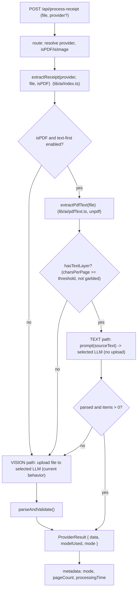

# PDF Text-First Extraction Transition

## Goal & decisions

Make PDF extraction **text-first**: when a PDF has a real text layer (the ~95% case in the sample corpus — Instacart/Amazon HTML-to-PDF receipts), extract the text server-side and send **text** to the currently-selected LLM instead of uploading the whole file as page images. Fall back to the **existing vision path** when a PDF has no usable text layer (photo-converted-to-PDF, scans), when text extraction is low-confidence, or when the text attempt fails — and always for raw images.

Why: PDF pages are billed as image input (~258+ tokens/page, often ~1,200/page via the AI-Studio SDK). Digital receipts extract to ~400-800 text tokens, which is cheaper, faster (no `files.upload` round-trip), and more accurate (no OCR misreads of prices/decimals). The savings are largest on the **default provider (OpenAI `gpt-4o`)**, which is priced well above Gemini Flash.

Defaults chosen (override on review):
- Library: **`unpdf`** (serverless build of PDF.js, zero native deps; verified API `getDocumentProxy(new Uint8Array(buffer))` -> `extractText(pdf, { mergePages })`; requires the Node runtime, which the route already sets).
- Scope: **phased** — Sprints 1-5 ship routing + fallback + the discount-accuracy fix; Sprint 6 (structured output) is optional and sequenced after.

## Changes from the first draft (re-review)

- The **discounted-line-total rule moved from "optional Sprint 6" into core Sprint 2**. The extracted text layer has no strikethrough, so promo receipts (e.g. RD "Buy 6 for $80.60" showing both `$203.88` and `$161.20`) can regress on price unless the prompt handles it.
- Added an **automatic text->vision fallback** (Sprint 4) for garbled/misleading text layers and parse failures — classification alone is not enough.
- Verification now uses the **USD total in each filename as an objective grand-total oracle** (Sprint 5) instead of comparing to vision output.
- Added **`unpdf` resource hardening** (page cap, `maxImageSize`, timeout race, page markers) per the library's own serverless guidance (Sprint 1).
- Committed to a dedicated **`extractReceipt()` orchestrator**; `runProvider` stays pure dispatch (Sprint 4).
- Added an **optional `pdfTextExtraction` kill-switch setting** (default on) so text-first can be disabled instantly if a regression appears.

## Guardrails (from DEVELOPER_GUIDE.md)

- Keep extraction provider-abstracted; the toggle in [lib/settingsStorage.ts](lib/settingsStorage.ts) / [lib/hooks/useSettings.ts](lib/hooks/useSettings.ts) must drive **both** paths. (§12)
- Reuse the single shared prompt ([lib/ai/prompt.ts](lib/ai/prompt.ts)) and the single validator `parseAndValidate()` ([lib/ai/parseResponse.ts](lib/ai/parseResponse.ts)). Do **not** fork either. (§9, §12)
- Keep `temperature: 0.1`; throw `MissingApiKeyError` / `ExtractionParseError`. (§12, §15)
- Route stays a thin controller — PDF detection/extraction/fallback is business logic and lives in `lib/ai/`. (§14)
- `runtime = 'nodejs'` + `maxDuration = 60` unchanged. (§11)
- Name new thresholds as constants (§18); update the structure tree + CONTEXT when adding a file (§2).

## Target architecture

Both TEXT and VISION converge on the same `parseAndValidate()` choke point and the same `ExtractedData` shape, so `app/page.tsx`, storage, items, and insights are unchanged.

## Sprint 0 — Foundations (dependency + shared types)

- Add `unpdf` (`npm install unpdf`). Server-only import; runs under the existing Node route runtime.
- [lib/ai/types.ts](lib/ai/types.ts): model the input as a discriminated union to avoid a "both file and text" ambiguity (§9):
  - `type ExtractionSource = { kind: 'file'; file: File } | { kind: 'text'; text: string }`
  - Keep `ProcessInput = { file: File; isPDF: boolean }` for the orchestrator; providers accept the resolved `ExtractionSource` (+ `isPDF`). Add `mode: 'text' | 'vision'` to `ProviderResult`.
- Add classification constants (§18): `MIN_CHARS_PER_PAGE`, `MIN_TOTAL_CHARS`, `MAX_GARBLED_RATIO`, plus hardening limits `MAX_PDF_PAGES`, `PDF_EXTRACT_TIMEOUT_MS`, `MAX_PDF_IMAGE_SIZE`.
- Optional kill-switch: add `pdfTextExtraction: boolean` (default `true`) to `AppSettings` in [lib/settingsStorage.ts](lib/settingsStorage.ts) + [app/api/settings/route.ts](app/api/settings/route.ts) + [lib/hooks/useSettings.ts](lib/hooks/useSettings.ts) + Settings UI. If you want to keep scope minimal, skip this and gate on an env flag instead.
- Depends on: nothing. Blocks: 1, 3, 4.

## Sprint 1 — PDF text extraction + classification (`lib/ai/pdfText.ts`)

- New file [lib/ai/pdfText.ts](lib/ai/pdfText.ts) (single responsibility, §6): `extractPdfText(file: File): Promise<PdfTextResult>` where `PdfTextResult = { text, pageCount, charCount, hasTextLayer, confidence }`.
- Implementation: `getDocumentProxy(new Uint8Array(await file.arrayBuffer()))`, then `extractText(pdf, { mergePages: false })` to get per-page strings; join with explicit `\n\n=== Page N ===\n\n` markers so the model can reason about page boundaries (mitigates the out-of-order-totals issue).
- Hardening (per unpdf serverless guidance): reject/bail if `pdf.numPages > MAX_PDF_PAGES`; pass `maxImageSize`; race the whole extraction against `PDF_EXTRACT_TIMEOUT_MS`.
- `hasTextLayer` heuristic (named constants, §18): true when `charsPerPage >= MIN_CHARS_PER_PAGE` AND `charCount >= MIN_TOTAL_CHARS` AND garbled ratio (non-printable / U+FFFD replacement chars) `<= MAX_GARBLED_RATIO`.
- On any extraction error/timeout, return `hasTextLayer: false` (safe fallback to vision) — never throw across into the route.
- Depends on: 0.

## Sprint 2 — Shared prompt: text-mode + discount accuracy (`lib/ai/prompt.ts`)

- Parametrize the existing prompt instead of forking (§12): `buildExtractionPrompt({ isPDF, sourceText? })`.
  - `sourceText` present: change only the framing ("Analyze this receipt text extracted from a PDF (page markers included):" + the text block); keep **all** pricing/date/bulk-vs-packaged rules identical.
  - absent: byte-for-byte the current vision prompt.
- **Add the discounted-line-total rule to the shared prompt (core).** When a line shows a promo/loyalty price (e.g. "Buy 6 for $80.60", "Loyalty savings: $4.00") with both an original and a discounted amount, use the **actually-charged (discounted)** amount as `totalPrice`. This benefits both paths but is required for text mode (no strikethrough). Add one worked example mirroring the RD receipt. Edit carefully — downstream analytics depend on the pricing model (§12).
- Update both provider call sites to the new signature.
- Depends on: nothing (parallel to 1). Blocks: 3.

## Sprint 3 — Provider text branches (`gemini.ts`, `openai.ts`)

- [lib/ai/gemini.ts](lib/ai/gemini.ts): for `kind: 'text'`, skip `files.upload`; call `generateContent` with `buildExtractionPrompt({ isPDF, sourceText })` (text only). Return `mode: 'text'`. `kind: 'file'` = current vision branch, `mode: 'vision'`.
- [lib/ai/openai.ts](lib/ai/openai.ts): for `kind: 'text'`, skip `files.create`; send `input_text` only via the Responses API. Return `mode: 'text'`. `kind: 'file'` = current branch, `mode: 'vision'`.
- Both keep `temperature: 0.1` and route raw text through `parseAndValidate()` (§9, §12).
- Depends on: 0, 2.

## Sprint 4 — Orchestration + fallback (`lib/ai/index.ts`) + route metadata

- Add `extractReceipt(provider, { file, isPDF })`: keep `runProvider` as pure provider dispatch; `extractReceipt` owns the routing:
  1. If not PDF (or text-first disabled): dispatch vision (`kind: 'file'`).
  2. If PDF: `extractPdfText(file)`; if `hasTextLayer`, dispatch text (`kind: 'text'`).
  3. **Automatic fallback:** if the text attempt throws `ExtractionParseError` or returns `items.length === 0`, retry once via vision (`kind: 'file'`). Log the fallback reason.
- Route [app/api/process-receipt/route.ts](app/api/process-receipt/route.ts) calls `extractReceipt` and adds `mode` (+ `pageCount`) to `metadata`. Response contract otherwise unchanged (§14). Note worst-case latency = one text call + one vision call; still within `maxDuration = 60`.
- Depends on: 1, 3.

## Sprint 5 — Verification against the real corpus

- `tsc --noEmit` + `npm run lint` clean.
- **Objective oracle:** each file in `/Users/msaifee/Documents/Receipt` (incl. `Old/`, `1 april/`) encodes its true total in the name (`USD 423.43 RD.pdf`). Assert extracted `total` == filename amount (within `0.01`) for both providers.
- Matrix over each store type (Instacart Walmart/Costco/CBC/RD/SnF/Bharat Bazar/Chef'Store, Amazon) on **both providers**; confirm TEXT mode is chosen and, for discounted receipts (RD), that line totals use the discounted price.
- Fallback checks: image-only case (`Old/USD 114.49 NIB.jpeg`) and a photo-converted-to-PDF classify as no-text -> VISION and still succeed; simulate a parse failure to exercise the text->vision retry.
- Capture `metadata.mode` + token usage to quantify savings.
- Add `scripts/test-pdf-extract.js` (mirrors `scripts/test-gemini.js`, added via `test:pdf` npm script) to batch-classify + run the filename-oracle check across the corpus.
- Depends on: 4.

## Sprint 6 — (Optional) structured output

- Switch to structured JSON output (Gemini `responseSchema` / OpenAI `json_object` or a JSON schema) while keeping `parseAndValidate()` as the validation choke point. Reduces the markdown-fence stripping and hardens parsing. Kept separate so core routing ships de-risked.
- Depends on: 5.

## Sprint 7 — Docs adherence

- Update [DEVELOPER_GUIDE.md](DEVELOPER_GUIDE.md) structure tree (§2) + §12 flow to include `lib/ai/pdfText.ts`, `extractReceipt`, and the text/vision branch + fallback.
- Update [CONTEXT.md](CONTEXT.md) §3 (map) and §4.1 (data flow) for the text-first path.
- Update [docs/PRD.md](docs/PRD.md) only if user-facing behavior is described (extraction accuracy/speed; the optional provider/kill-switch setting).
- Add a short entry to [DEVELOPER_GUIDE_AUDIT.md](DEVELOPER_GUIDE_AUDIT.md) covering the new file.
- Depends on: 4 (finalize after 6 if 6 is done).

## Risks / notes

- **Strikethrough loss (handled in Sprint 2):** text mode can't see struck-through original prices; the discount rule + text->vision fallback mitigate this.
- **Reading order:** extracted text is often out-of-order (totals/last item can precede others). Page markers + the LLM's reassembly handle it; this is why we keep the LLM on the text path rather than regex-parsing.
- **Store name as logo:** if a receipt's store name is only a logo image (not text), text mode may miss `storeNameScanned`. Low impact — the user selects the canonical store manually; `storeNameSelected` is unaffected.
- **Latency on fallback:** a text miss costs an extra vision call; acceptable within `maxDuration = 60`.
- **Threshold tuning:** start conservative (bias toward vision on doubt); adjust from Sprint 5 data.
- **Dependency:** `unpdf` is the only new runtime dep; swapping to `pdf-parse`/`pdfjs-dist` would change only Sprint 1's import.
