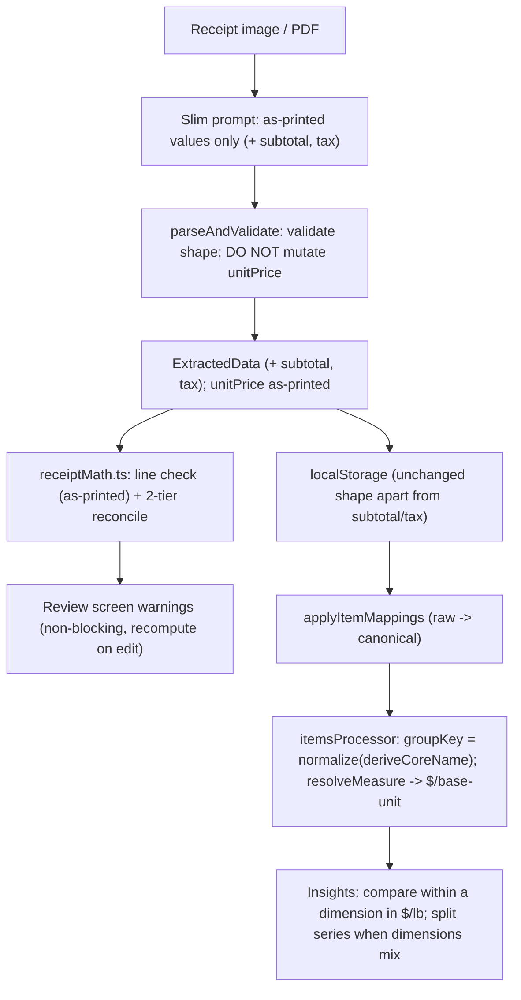

# Receipt Math Validation And Per-Unit Normalization

## Guiding principle (why this handles anything)
**As-printed values are the only stored source of truth; every measurement, comparison, and validation is a pure function derived at read time** — exactly like the existing `applyItemMappings` overlay ([lib/itemMappings.ts](lib/itemMappings.ts)) and consistent with DEVELOPER_GUIDE §19. This one decision is what makes the feature robust:
- New receipts, old receipts, loose, bulk, and packaged items all flow through the **same** `resolveMeasure()`, so there is no per-shape branching scattered across the app.
- Because pack size / base unit / price-per-unit are recomputed on every read, **existing localStorage receipts get the corrected analytics for free — no migration, no backfill script** (see "Retroactive correctness" below).
- Validation always runs against what the receipt literally printed, so it can never be fooled by a value the app itself computed.

## Decisions locked in (from you), refined
- Math tolerance: strict rounding — `round(quantity x unitPrice, 2)` must match the printed line total within **1 cent** — but this check only runs on lines where the receipt **actually printed a unit price** (otherwise there is nothing independent to cross-check).
- On mismatch: **flag/highlight** the row on the review screen with a non-blocking warning; still allow save. No auto-correct.
- Reconcile totals in **two independent tiers** (more meaningful than one check, now that we also extract `subtotal`): (A) `sum(line totals) ≈ subtotal`, (B) `subtotal + tax ≈ grand total`. Any residual gap is reported as an informational "unaccounted adjustments (fees / deposits / coupons) of $X", never as an error.
- Onion case: **auto-parse pack size** from the item name at read time; loose "Red Onion" and "Red Onion 25lb" fold into the **same item**. They are only averaged together when they share a **dimension** (both mass); a loose onion genuinely sold *by each* is shown as a separate `ea` series with a "mixed units" note rather than a fabricated $/lb comparison.
- Architecture: **all packaged-vs-bulk logic moves out of the LLM prompt into deterministic code**; the model returns only as-printed values.

## New data model (minimal — store only genuine as-printed facts)
- `ExtractedData` ([lib/types.ts](lib/types.ts)) gains optional `subtotal?: number | null` and `tax?: number | null`. These are printed on the receipt and are **not** derivable, so they are stored.
- `ReceiptItem` is **unchanged** — no `packSize`/`packUnit` fields. Pack size is *parsed from `name` on every read* by `resolveMeasure`, so it applies to old and new receipts identically and needs no migration. (The existing mappings layer remains the escape hatch for user overrides/splits.)
- `unitPrice` stays **strictly as-printed** (nullable). We stop overwriting it with a computed value (see Phase 2) so the line-math check has an honest input; display uses a derived `displayUnitPrice()` helper instead.
- All validation and measure results are **derived, never stored** (pure functions), consistent with DEVELOPER_GUIDE §19.

## Core concept: `resolveMeasure(item)` — one function, every case
Each line resolves to a canonical **base unit** per dimension (mass -> `lb`, volume -> `l`, count -> `ea`) via a strict priority ladder. This ladder is the whole ballgame — it must be deterministic and total (always returns something finite):

```
resolveMeasure(item) -> { baseQuantity, baseUnit, dimension, source }

(a) unit is a MASS or VOLUME unit (lb/oz/g/kg | ml/l/floz/gal):
      trust the printed unit as the purchased measure.
      baseQuantity = toBaseQuantity(quantity, unit);  dimension = that unit's dimension.
      // loose ginger: qty 15.83, unit lb -> 15.83 lb.  OLD bulk paneer: qty 226, unit g -> 0.498 lb.

(b) else if a pack size is parseable from the name (parsePackSize != null):
      quantity is a COUNT of packages (default 1).
      baseQuantity = (quantity || 1) x toBaseQuantity(packSize, packUnit);  dimension from packUnit.
      // onion bag: qty 4, unit ea/null, name "...25LB" -> 4 x 25 = 100 lb.
      // NEW packaged paneer: qty 1, unit null, name "...226 G" -> 0.498 lb.  (matches OLD row above!)

(c) else (no measure unit, no parseable pack size):
      count dimension.  baseQuantity = quantity || 1;  baseUnit = 'ea';  dimension = 'count'.
      // "Mushroom Box": qty 1 -> 1 ea.

GUARDS: if baseQuantity is 0, negative, NaN, or non-finite at any branch, fall back to
        { baseQuantity: quantity || 1, baseUnit: 'ea', dimension: 'count' }, and if still
        unusable, price = totalPrice at baseQuantity 1. Never emit NaN into a chart.
```

`pricePerBaseUnit(item) = round(totalPrice / baseQuantity, 4)`, tagged with `baseUnit` + `dimension`. This is what Insights compares.

**Why (a) before (b):** trusting a printed weight/volume unit prevents double-counting a size token that also appears in the name. **Why null/`ea` unit falls to (b):** a 25lb bag prints the "25LB" in its *name*, not as its purchased unit, so pack-size parsing (not the count unit) is what carries the weight.

## Retroactive correctness (no migration)
Because measure is derived, the same worked examples land identically for **stored (old-prompt) and future (slim-prompt)** rows:

| Item | Old-prompt row (in storage today) | New slim-prompt row | resolveMeasure result |
|---|---|---|---|
| Bulk paneer 226 G, $4.49 | `qty 226, unit g` -> path (a) | `qty 1, unit null, name "...226 G"` -> path (b) | **0.498 lb -> $9.01/lb** (both) |
| Packaged sambar 283g, $3.49 | `qty 1, unit null` -> path (b) | `qty 1, unit null` -> path (b) | **0.623 lb -> $5.60/lb** (both) |
| Onion 25LB bag x4, $55.96 | (n/a — new) | `qty 4, unit ea/null, name "...25LB"` -> path (b) | **100 lb -> $0.56/lb** |
| Loose ginger, $20.42 | `qty 15.83, unit lb` -> path (a) | `qty 15.83, unit lb` -> path (a) | **15.83 lb -> $1.29/lb** |

The pre-existing bug (`totalPrice / quantity` gave $0.0199/g for bulk and $/package for packaged — incomparable) is fixed for historical data the moment this ships, with no data touched. The old stored per-gram `unitPrice` is simply ignored by analytics (which uses `totalPrice / baseQuantity`).

## Data flow



## Phase 1 — Deterministic core (pure libs, no UI)
- `lib/units.ts`: canonical base unit per dimension + conversion table (`lb`,`lbs`,`oz`,`g`,`kg` -> mass base `lb`; `ml`,`l`,`floz`,`gal` -> volume base `l`; `ea`,`pcs`,`ct`,`pk` and `null` -> count base `ea`). Exports `normalizeUnit(raw)`, `unitDimension(unit) -> 'mass'|'volume'|'count'`, `toBaseQuantity(qty, unit)`. Unknown units resolve to the count dimension (never throw).
- `lib/packSize.ts`:
  - `parsePackSize(name) -> { packSize, packUnit } | null` — regex for tokens like `25LBS`, `226 G`, `64oz`, `1.5KG`, `500ML`, `2L`, `310g`, `283GM/10oz`. Rules: (1) prefer the **metric/weight** token when several are present; (2) handle **multipack** `N x M<unit>` by returning the per-unit `M<unit>` and letting `quantity` carry N; (3) **false-positive guards** — a numeric token must be immediately adjacent to a known unit; ignore `%`, `#`, standalone counts, and marketing digits like `50-50` / `2%`; (4) **return `null` when unsure** (conservative — an unsure parse falls to count, which is safe, rather than inventing a weight).
  - `deriveCoreName(name)` strips size/multipack tokens for grouping (`"RED ONION 25LBS"` -> `"Red Onion"`), leaving descriptive adjectives intact so distinct products stay distinct.
- `lib/measure.ts`: `resolveMeasure(item)` (the ladder above, total + guarded), `pricePerBaseUnit(item)`, and `displayUnitPrice(item) = item.unitPrice ?? (item.totalPrice / (item.quantity || 1))` for UI only.
- `lib/receiptMath.ts`: pure functions returning structured `{ ok, kind, expected, actual, message }[]`:
  - `validateLineItem(item, tol=0.01)` — **only** when `item.unitPrice` is a printed non-null number *and* quantity and totalPrice are present; checks `round(quantity x unitPrice, 2)` vs `totalPrice`. Skips (returns ok) otherwise, so backfilled/absent unit prices never produce a vacuous pass or a false alarm.
  - `validateReceiptTotals(data, { lineTol, footerTol })` — tier A `sum(lineTotals)` vs `subtotal` (when present), tier B `subtotal + (tax||0)` vs `total`; when `subtotal` is absent, fall back to `sum(lineTotals) + (tax||0)` vs `total` at the looser footer tolerance. Returns any residual as an informational `unaccounted-adjustments` entry, not an error.
  - Tolerances: `lineTol` scales with item count (`max($0.05, 0.01 x nItems)`); `footerTol = max($0.05, 0.5% of total)` to absorb CRV/deposits/coupons without crying wolf.

## Phase 2 — Slim prompt + stop mutating unitPrice
- [lib/ai/prompt.ts](lib/ai/prompt.ts): remove Examples 3-7 and the packaged-vs-bulk "QUANTITY & UNIT PRICE CALCULATION" block + rule-of-thumb. Instruct the model to return **exactly what is printed** per line: `name` (including any size text), `quantity` from the qty/count column **defaulting to 1** (never fold a net weight into quantity), `unit` as printed or `null`, `unitPrice` as printed or `null`, `totalPrice` as charged. **KEEP** the multi-line combination rule, the discounts/promotions rule (charge the LOWER amount — this is an as-charged fact, not bulk logic), the date rule, and the store rule. Add `subtotal` and `tax` to the required JSON. This is the main token reduction.
- [lib/types.ts](lib/types.ts): add `subtotal?`/`tax?` to `ExtractedData` (leave `ReceiptItem` untouched).
- [lib/ai/parseResponse.ts](lib/ai/parseResponse.ts): **remove the unitPrice backfill mutation** (lines ~74-86) so `unitPrice` stays as-printed (`null` when not printed). Validate `subtotal`/`tax` as optional numbers-or-null. Keep the `{ items, total }` contract and the route untouched (DEVELOPER_GUIDE §14). Grep for consumers that assumed a non-null `unitPrice` and route them through `displayUnitPrice()` (display already renders `-` for null, so most need nothing).

## Phase 3 — Per-base-unit derivation + grouping
- [lib/itemsProcessor.ts](lib/itemsProcessor.ts): the derivation pipeline is **mappings first, then core-name grouping** — `groupKey(name) = normalizeItemName(deriveCoreName(name))`, run on the already-mapping-resolved receipts (callers pass `applyItemMappings(receipts, mappings)` exactly as today). Replace `price = totalPrice / (quantity || 1)` with `pricePerBaseUnit(item)`; add `baseUnit` + `dimension` to `ItemPriceEntry`/`ProcessedItem`. **Never average across dimensions**: when a group mixes dimensions, keep all entries but treat each dimension as its own comparison track. Update `getItemByName`/`searchItems`/`getAllItemNames` to compare on `groupKey` so lookups line up with grouping.
- **Routing:** `ProcessedItem.normalizedName` becomes the `groupKey`; [app/items/[name]/page.tsx](app/items/[name]/page.tsx) already routes by name via `getItemByName(applyItemMappings(...))`, so it keeps working as long as `getItemByName` compares on `groupKey`. The rename handler stays correct because mappings still resolve before core-name derivation. Add a short comment documenting this order so it is not reshuffled later.
- [lib/analyticsUtils.ts](lib/analyticsUtils.ts) + [app/insights/page.tsx](app/insights/page.tsx): label prices with the base unit (e.g. `$0.56/lb`) in stat cards, chart axis, and tooltip. When a resolved item spans **multiple dimensions**, split the chart series by `store × dimension` and show a small "mixed units — comparing within each unit type" note instead of averaging count and weight together. `prepareChartData`/`calculateStatistics` operate within a single dimension.

## Phase 4 — Surface validation on the review screen
- [app/components/ExtractedDataDisplay.tsx](app/components/ExtractedDataDisplay.tsx): run `validateLineItem` per row against `editedItems` (as-printed unit price) and `validateReceiptTotals` for the footer; highlight failing rows (`--error-*` CSS vars, Lucide `AlertTriangle`) with a tooltip showing expected vs printed; show a non-blocking banner if totals don't reconcile, and a neutral note for `unaccounted-adjustments`. Because validation is a pure function of the row, it **recomputes reactively as the user edits** (the existing `saveFieldEdit` already recomputes `totalPrice`), so a warning clears the instant the user fixes the number. Saving remains allowed (DEVELOPER_GUIDE §15 inline messaging).

## Phase 5 — Docs
- Update [DEVELOPER_GUIDE.md](DEVELOPER_GUIDE.md) (structure tree + data-model + derived-data sections) to document the read-time measure/validation layer and the `resolveMeasure` ladder; [docs/PRD.md](docs/PRD.md) for the comparability feature; and `CONTEXT.md` for the new `ExtractedData` fields and the "no-migration / retroactive" property.

## Edge-case matrix (the "handle anything" checklist)
- **Loose weight, no unit price printed** (`0.10 lb` line): path (a); line check skipped (no printed unitPrice); $/lb from total.
- **Onion 25LB bag, unit `ea`/null**: path (b), 100 lb, $/lb.
- **Packaged item, brand + net weight in name**: path (b) from parsed pack size; comparable to loose on $/lb.
- **Loose onion sold by each** (`qty 3, ea`, no size token): path (c); shown as `ea` series, flagged mixed vs any lb series — no fabricated comparison.
- **Multipack `12 x 50g`**: `quantity 12`, packSize `50g` -> 600 g base.
- **Marketing digits `50-50`, `2%`, `#10 can`**: `parsePackSize` returns null (guards) -> path (c), no bad weight.
- **Zero/blank quantity, or `totalPrice/baseQuantity` non-finite**: guard falls back to count/1, never NaN.
- **Receipt with CRV/bag deposit/coupon not itemized**: tiers A/B still pass within tolerance; residual reported as informational adjustment, save unaffected.
- **Old stored receipts (old prompt)**: converge to the same base quantity as the new prompt (see table); analytics corrected retroactively, no migration.
- **subtotal/tax missing**: reconciliation falls back to `sum(lines)+tax` (or lines-only) at the looser tolerance; never blocks.

## Open notes / risks
- `deriveCoreName` could occasionally over-merge distinct products that share a prefix and differ only by a stripped size; the mappings layer is the escape hatch to force a split (map one raw name to a distinct canonical). Adjectives are preserved, which limits this.
- `parsePackSize` is deliberately conservative (null when unsure) — this can *under*-normalize a genuinely-weighed item whose size token it fails to recognize (it stays in the `ea`/count track and shows as a separate series). That is a visible, correctable miss rather than a silent wrong number; expand the token regex over time.
- Removing the unitPrice backfill means the review table shows `-` for unit price on weight lines where the receipt printed none; `displayUnitPrice()` restores a computed value for display without polluting the stored/validated value. Confirm no downstream consumer read the backfilled `unitPrice` as authoritative (grep in Phase 2).
- Footer tolerance is percentage-based to stay quiet on real grocery receipts; both tolerances are single-sourced constants in `receiptMath.ts`, easy to tune or make user-configurable later.

## As-built notes (deviations from the plan above)
These reconcile the plan text with what actually shipped (all deliberate):
- **Primary dimension = dominant (most-frequent), not latest.** Choosing the latest entry's dimension let a single recent by-each purchase hide a rich by-weight comparison; `itemsProcessor.dominantDimension()` picks the most-frequent dimension (ties → most recent).
- **Insights charts the dominant dimension only + a "mixed units" note** — not a per-`store × dimension` series split. Two incomparable Y-axes on one chart is worse UX; minority-dimension purchases are excluded from the plot and flagged by the note. `prepareChartData`/`calculateStatistics` operate within that single dimension via `primaryDimensionHistory()`.
- **`validateReceiptTotals(data)`** takes no options object; the line/footer tolerances are single-sourced exported constants in `receiptMath.ts` (§18).
- **Line warnings render inline under the item name** (icon + tooltip of expected vs printed), not as a full-row background highlight — avoids conflicting with the existing row hover handlers.
- **`searchItems` matches on `normalizeItemName(searchTerm)`** against the (core-name) `normalizedName`, so partial queries still match; only `getItemByName` needs the full `groupKey`.
- **Promo/discounted lines extract `unitPrice: null`** (the charged per-unit isn't printed) so the line-math check never false-flags a legitimate discount.

## Follow-up feature: additional charges (service / delivery / bag fees, deposits, tips)
Receipts (esp. delivery PDFs) carry named non-item charges between subtotal and total that were previously invisible — folded silently into the grand total.
- `ExtractedData` gains `additionalCharges?: { label: string; amount: number }[] | null` (as-printed, stored — like subtotal/tax). `parseResponse` normalizes it (drops malformed entries, absent → `[]`).
- The prompt extracts every non-item fee into `additionalCharges[]` with its printed label and amount (kept out of `items` and `tax`).
- `receiptMath.sumAdditionalCharges()` folds these into tier-B reconciliation (`subtotal + tax + charges ≈ total`), so the "unaccounted adjustments" note now fires only for genuinely uncaptured amounts. `receiptMath.totalsBreakdown(data)` returns the labeled Subtotal/Tax/fee lines.
- `ExtractedDataDisplay` (review) and `ReceiptDetailView` (saved receipt) render that breakdown above the grand total, so a service/delivery fee is visible instead of disappearing.
