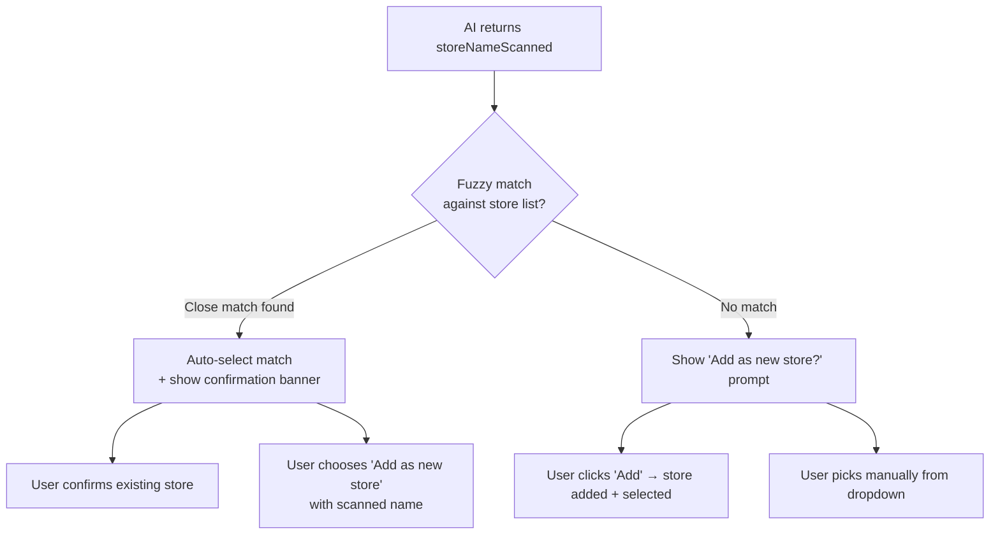

# Smart Store Name Matching

## Current behavior

1. AI extracts `storeNameScanned` (e.g. "WALMART SUPERCENTER #1234")
2. It shows as a passive "Detected Store" label in `ExtractedDataDisplay`
3. The store dropdown (`StoreSelection`) is completely independent -- user must manually select

## Proposed behavior




## Implementation

### 1. Add fuzzy matching utility -- new file `lib/storeMatching.ts`

A simple scoring function that checks if a scanned name contains or closely matches an existing store name (case-insensitive substring + normalized comparison). No external library needed.

```typescript
export function findClosestStore(
  scannedName: string,
  stores: string[]
): { match: string; confidence: 'exact' | 'high' | 'none' } 
```

Logic:

- Normalize both strings (lowercase, trim, strip common suffixes like "supercenter", "#1234", "inc", "llc")
- **Exact**: normalized scanned name equals a normalized store name
- **High**: one contains the other (e.g. "walmart supercenter" contains "walmart")
- **None**: no meaningful overlap

### 2. Add a `StoreSuggestionBanner` component -- new file `app/components/StoreSuggestionBanner.tsx`

Renders between the "Detected Store" label and the store dropdown. Two modes:

**Mode A -- Match found** (confidence is `exact` or `high`):

> "Detected **WALMART SUPERCENTER #1234** -- matches your existing store **Walmart**."
> [Use Walmart] [Add "WALMART SUPERCENTER #1234" as new store]

**Mode B -- No match**:

> "Detected **PATEL BROTHERS** -- not in your store list."
> [Add "Patel Brothers" as new store] [Select manually]

Clicking "Use [existing]" auto-selects the matched store in the dropdown.
Clicking "Add as new store" calls `onAddStore` with the scanned name and selects it.
Clicking "Select manually" dismisses the banner.

### 3. Wire it up in `app/page.tsx`

After `extractedData` is set (in the `useReceiptProcessing` flow), run the matching:

```typescript
useEffect(() => {
  if (extractedData?.storeNameScanned && stores.length > 0) {
    const result = findClosestStore(extractedData.storeNameScanned, stores);
    if (result.confidence !== 'none') {
      setSelectedStore(result.match); // auto-select the match
    }
    setStoreMatch(result); // store the result so the banner can render
  }
}, [extractedData, stores]);
```

New state: `storeMatch` (the result from `findClosestStore`), plus a `storeBannerDismissed` boolean.

The `StoreSuggestionBanner` renders inside the "Receipt Details" `Card`, between the store label and the `StoreSelection` dropdown, only when `extractedData?.storeNameScanned` exists and the banner hasn't been dismissed.

### 4. Remove the passive "Detected Store" display from `ExtractedDataDisplay`

The "Detected Store: ..." line at [app/components/ExtractedDataDisplay.tsx lines 88-94](app/components/ExtractedDataDisplay.tsx) becomes redundant since the banner in `page.tsx` now shows the detected name with actionable options. Remove it.

## Files changed

- **New:** `lib/storeMatching.ts` -- fuzzy match function (~30 lines)
- **New:** `app/components/StoreSuggestionBanner.tsx` -- the UI banner (~80 lines)
- **Modified:** `app/page.tsx` -- add `useEffect` for matching, render the banner, pass callbacks
- **Modified:** `app/components/ExtractedDataDisplay.tsx` -- remove the passive "Detected Store" display

