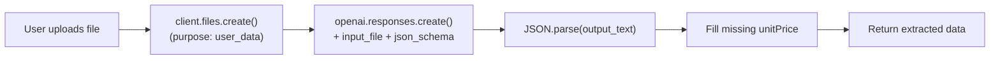

# Switch from Gemini to OpenAI for Receipt Extraction

## What changes

Replace the Google Gemini SDK with the OpenAI SDK, matching the proven pattern from the tax2 project: upload the file via `client.files.create()`, reference it with `input_file`, and use **structured output** (`json_schema` + `strict: true`) to guarantee valid JSON responses.




## Files to change

### 1. Install `openai`, remove `@google/genai`

```bash
npm install openai && npm uninstall @google/genai
```

### 2. Update [lib/constants.ts](lib/constants.ts)

```typescript
// Before
export const GEMINI_MODEL = 'gemini-2.0-flash';

// After
export const OPENAI_MODEL = 'gpt-4o-mini';
```

Using `gpt-4o-mini` as the default (same as tax2), with support for override via `OPENAI_EXTRACTION_MODEL` env var.

### 3. Update [lib/receiptParser.ts](lib/receiptParser.ts)

Add a JSON schema constant that describes the receipt extraction shape, used by OpenAI's structured output to guarantee conformant responses:

```typescript
export const receiptJsonSchema = {
  type: "object",
  properties: {
    storeNameScanned: { type: ["string", "null"] },
    receiptDate: { type: ["string", "null"] },
    items: {
      type: "array",
      items: {
        type: "object",
        properties: {
          name: { type: "string" },
          quantity: { type: "number" },
          unitPrice: { type: ["number", "null"] },
          totalPrice: { type: "number" },
          unit: { type: ["string", "null"] },
        },
        required: ["name", "quantity", "totalPrice", "unitPrice", "unit"],
        additionalProperties: false,
      },
    },
    total: { type: "number" },
  },
  required: ["storeNameScanned", "receiptDate", "items", "total"],
  additionalProperties: false,
};
```

The existing `parseReceiptResponse()` function is simplified: with structured output, the response is always valid JSON -- no need for markdown fence stripping or regex extraction. Keep the `unitPrice` backfill logic.

### 4. Rewrite [app/api/process-receipt/route.ts](app/api/process-receipt/route.ts)

This is the main change. Follow the tax2 pattern from `extraction/openai.ts`:

**a) OpenAI client setup** -- read `OPENAI_API_KEY` from env (the SDK reads it automatically).

**b) File upload** -- use `client.files.create({ file, purpose: "user_data" })` to upload the receipt, getting back a `file_id`. This handles both images and PDFs natively.

**c) Responses API call** -- use `client.responses.create()` with:

- `input_file` referencing the uploaded `file_id`
- `input_text` with the prompt from `buildReceiptPrompt()`
- `text.format` set to `json_schema` with the receipt schema (structured output)

**d) Parse response** -- `JSON.parse(response.output_text)` directly (no regex needed thanks to structured output). Apply the unitPrice backfill from `parseReceiptResponse()`.

**e) Error handling** -- map OpenAI-specific errors (missing key, rate limit, network) to user-friendly messages.

Key code pattern (matching tax2):

```typescript
import OpenAI from "openai";
import { OPENAI_MODEL } from "@/lib/constants";
import { receiptJsonSchema } from "@/lib/receiptParser";

const client = new OpenAI();

// Upload file
const uploaded = await client.files.create({
  file: formDataFile,
  purpose: "user_data",
});

// Extract with structured output
const response = await client.responses.create({
  model: process.env.OPENAI_EXTRACTION_MODEL || OPENAI_MODEL,
  input: [{
    role: "user",
    content: [
      { type: "input_file", file_id: uploaded.id },
      { type: "input_text", text: buildReceiptPrompt(isPDF) },
    ],
  }],
  text: {
    format: {
      type: "json_schema",
      name: "extract_receipt",
      schema: receiptJsonSchema,
      strict: true,
    },
  },
});

const data = JSON.parse(response.output_text);
```

### 5. Update [app/components/Settings.tsx](app/components/Settings.tsx) line 250

Change the About section from `Google Gemini 2.0 Flash` to `OpenAI GPT-4o Mini`.

### 6. Update `.env.local`

Add `OPENAI_API_KEY=sk-...`. The old `GEMINI_API_KEY` can be removed. Optionally set `OPENAI_EXTRACTION_MODEL` to override the default model.

## What does NOT change

- [lib/receiptPrompt.ts](lib/receiptPrompt.ts) -- the prompt text is model-agnostic, no changes needed
- All other files -- the rest of the app only consumes the extracted data, never touches the AI provider

